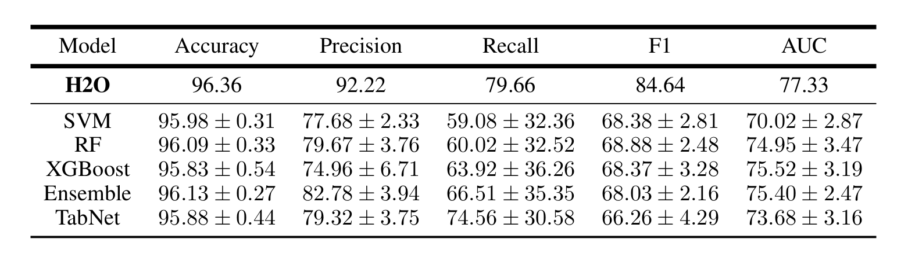

# Tide-DS-Task

## Results

### To run the  `Tide-DS-Task.ipynb`
- Create python environment and install dependencies from requirements.txt
- Put your `data` in `data/` and starting running the notebook sequentially

### To run `evaluate.py`
- Make sure that you have `test` data in `data/` and H2O model weights in `models`
- Check the path in the evaluate.py and make sure that they're correct
- Run evaluate.py 
